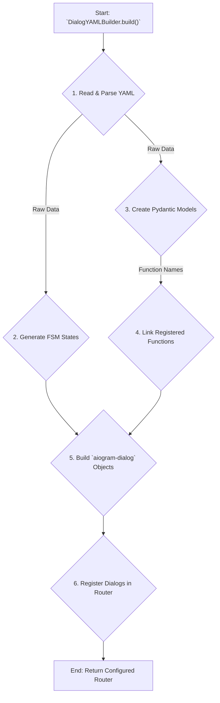
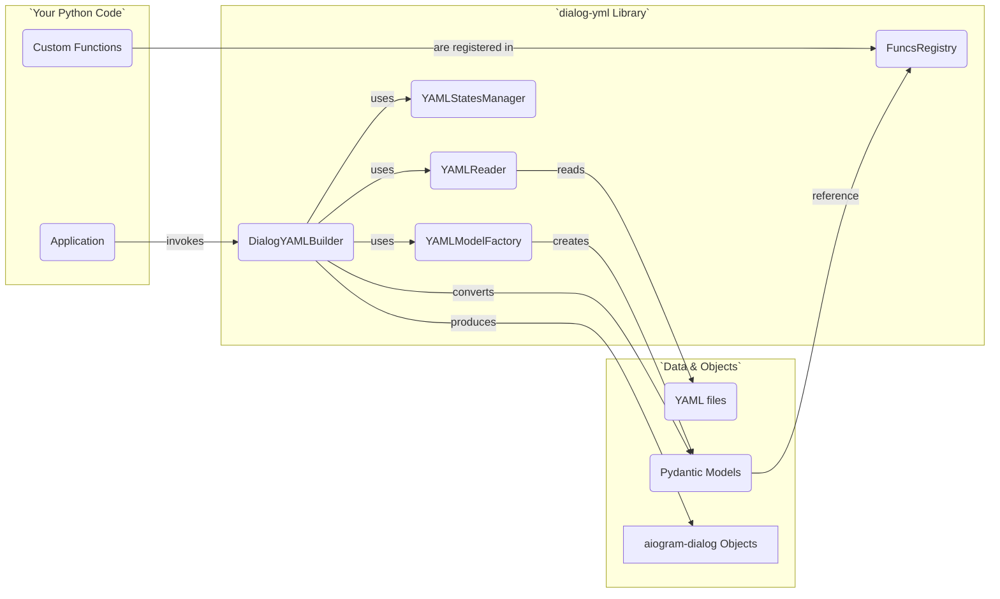

# dialog-yml

[English](README.md) | [Русский](README.ru.md)

[](https://www.python.org/downloads/) [](https://pypi.org/project/aiogram-dialog/) [](https://opensource.org/licenses/MIT) [](https://pypi.org/project/dialog-yml/)

---

> ⚠️ **WARNING**: This library is experimental. The author is not responsible for any problems that may arise from its use.

A Python library that provides a declarative, YAML-based configuration layer for building [aiogram-dialog](https://github.com/tishka17/aiogram_dialog) applications. It acts as a wrapper, allowing developers to define complex dialog flows, windows, and widgets declaratively in YAML, thus simplifying development without replacing the need to understand the underlying aiogram-dialog library.

## 📖 Overview

The `dialog-yaml` library provides a `DialogYAMLBuilder` class that reads YAML configuration files and converts them into functional aiogram dialogs. This approach allows for rapid prototyping and easier management of complex dialog structures without writing extensive Python code.

## ✨ Features

- **Declarative Dialog Definition**: Define dialogs, windows, and widgets using YAML files.
- **Modular Structure**: Support for including separate YAML files using `!include` directive.
- **YAML Anchors**: Support for YAML anchors (`&`) and references (`*`) to avoid duplication.
- **Built-in Widgets**: Support for various `aiogram-dialog` widgets including:
  - Text elements
  - Keyboard widgets
  - Calendar widgets
  - Selection widgets
  - Scrolling widgets
  - Counter widgets
  - Media widgets
  - and more...
- **Custom Functions**: Extensible function registry for custom business logic.
- **Custom Models**: Ability to register custom widget models.
- **State Management**: Automatic generation and management of FSM states from YAML configuration.
- **Flexible Configuration**: Support for custom states groups and models.

## ⚙️ How It Works

The library orchestrates the conversion from declarative YAML files to functional `aiogram-dialog` objects. Here's a look at the internal process and how the components interact.

<details>
<summary><b>Diagram 1: High-Level Data Flow</b></summary>

This diagram shows the journey from a YAML file to a ready-to-use `aiogram` router.



</details>

<details>
<summary><b>Diagram 2: Component Interaction</b></summary>

This diagram illustrates how the major internal components of `dialog-yaml` work together.



</details>

## 📦 Installation

For installation use pip:

```bash
pip install dialog-yml
```

Or if you use uv (recommended):

```bash
uv pip install dialog-yml
```

## 🧰 Requirements

- Python >= 3.13 (use a virtual environment)
- aiogram >= 3.24.0
- aiogram-dialog >= 2.4.0
- pydantic >= 2.12.5
- PyYAML >= 6.0.3
- pyyaml-include >= 2.2

Note: Do not commit .env files.

## 👤 Usage (for Users)

### ⚙️ Basic Setup

Here's a basic example of how to use the library:

```python
from aiogram import Router
from dialog_yml import DialogYAMLBuilder

# Build the dialog from a YAML file
dy_builder = DialogYAMLBuilder.build(
    yaml_file_name="main.yaml",
    yaml_dir_path="path/to/yaml/files",
    router=Router(),
)

# Access the configured router
router = dy_builder.router
```

### Accessing FSM states from the builder

You can access dynamically generated states with dot-notation:

```python
builder = DialogYAMLBuilder.build(
    yaml_file_name="main.yaml",
    yaml_dir_path="...",
)
# Example: navigate to a state
menu_main = builder.states.Menu.MAIN
```

### 📄 YAML Structure

The basic structure of a dialog YAML file:

```yaml
---
dialogs:
  DialogGroupName:  # This will become a StatesGroup name
    launch_mode: ROOT  # Optional launch mode
    windows:
      STATE_NAME:  # This will become a State name
        widgets:
          - text: "Hello, World!"
          - button:
              text: "Click me"
              id: click_btn
              on_click: my_function
...
```

### ⚙️ Custom Logic with Functions

While YAML is great for defining the UI structure, you'll need Python functions for business logic. `dialog-yaml` allows you to link Python functions to your widgets for two main purposes: **Event Handlers** and **Data Getters**.

First, you need a place to register your functions.

```python
# funcs.py
from dialog_yml import FuncsRegistry

# Create a global registry
funcs_registry = FuncsRegistry()

# Now, add functions to this registry (see examples below)
```

`dialog-yaml` uses a global singleton for the registry. You don't need to pass it during the build process. The most important thing is to **ensure the Python module where you define and register your functions is imported** before the bot starts running.

```python
# main.py - Your application's entry point
from aiogram import Router
from dialog_yml import DialogYAMLBuilder

# Import the module where you defined `funcs_registry` and registered functions.
# This ensures the functions are added to the global registry.
import my_project.dialogs.funcs 

# ... setup bot and dispatcher ...

# Now build the dialogs. The builder will automatically find the registered functions.
dy_builder = DialogYAMLBuilder.build(
    yaml_file_name="main.yaml",
    yaml_dir_path="path/to/yaml/files",
    router=router,
)
```

#### Event Handlers

Event handlers are functions that respond to user actions, such as clicking a button or selecting an item. You can assign them to fields like `on_click`, `on_selected`, `on_process_result`, etc.

The key thing to remember is that the **function signature must match what `aiogram-dialog` expects** for that specific handler. `dialog-yaml` simply passes your function along.

**Python code:**

```python
# funcs.py
from aiogram.types import CallbackQuery
from aiogram_dialog import DialogManager
from aiogram_dialog.widgets.kbd import Button

# Correct signature for a Button's on_click event
async def on_button_click(
    callback: CallbackQuery,
    widget: Button,
    manager: DialogManager,
):
    print(f"Button '{widget.widget_id}' was clicked!")
    await manager.next()

funcs_registry.register(on_button_click)
```

**YAML file:**

```yaml
# ...
- button:
    text: "Click me"
    id: click_btn
    on_click: on_button_click # Function name
```

> 💡 **Tip**: To find the correct signature for a handler, refer to the official [aiogram-dialog documentation](https://aiogram-dialog.readthedocs.io/en/latest/).

#### Data Getters

Data getters are functions that supply dynamic data to your widgets, such as text for a `Format` widget or a list of items for a `Select` widget. You can assign them to fields like `text`, `items`, `when`, etc.

These functions are typically called with `(DialogManager, **kwargs)` and should return the data in the format expected by the widget.

**Python code:**

```python
# funcs.py
from aiogram_dialog import DialogManager

async def get_user_name(manager: DialogManager, **kwargs):
    # You can get data from the dialog_manager
    return {"user_name": manager.event.from_user.full_name}

async def get_products_for_select(**kwargs):
    return [
        ("Apples", "fruit_apple"),
        ("Oranges", "fruit_orange"),
        ("Steak", "meat_steak"),
    ]

funcs_registry.register(get_user_name)
funcs_registry.register(get_products_for_select)
```

**YAML file:**

```yaml
# ...
- text:
    text: "Hello, {user_name}!"
    data: get_user_name # This getter provides the data for formatting
# ...
- select:
    id: products
    items: get_products_for_select # This getter provides the list of items
    item_id_getter: 1 # Use the second element of the tuple as item_id
    on_selected: on_product_selected
```

#### Passing Static Data from YAML

You can also pass static data from your YAML file directly to your Python function. This is useful for making functions reusable.

To do this, define the function reference as an object in YAML, with `name` being the function name and other keys being your static data.

**Python code:**

```python
# funcs.py
from aiogram.types import CallbackQuery
from aiogram_dialog import DialogManager
from aiogram_dialog.widgets.kbd import Button

# This function will receive the extra data in its `data` parameter
async def on_navigate(
    callback: CallbackQuery,
    widget: Button,
    manager: DialogManager,
    data: dict,
):
    target_state = data.get("target_state")
    if target_state:
        # You need to resolve the state string to a State object here
        # (This is a simplified example)
        await manager.start(target_state)

funcs_registry.register(on_navigate)
```

**YAML file:**

```yaml
# ...
- button:
    text: "Go to Profile"
    id: go_profile
    on_click:
      name: on_navigate
      target_state: "UserProfile:main" # Static data passed to the function
- button:
    text: "Go to Settings"
    id: go_settings
    on_click:
      name: on_navigate
      target_state: "Settings:main" # Same function, different data
```

### 📌 Using YAML Anchors

To avoid duplication in YAML files, you can use anchor data:

```yaml
---
anchors:
  back_button: &back
    id: back
    text: "Back"
    state: Menu:MAIN
  multi_select: &multi_select_config
    checked: {val: "✓ {item[0]}", formatted: true}
    unchecked: {val: "{item[0]}", formatted: true}
    id: ms
    items: products
    item_id_getter: 1

windows:
  MAIN:
    widgets:
      - text: "Main Menu"
      - button:
          text: "To Settings"
          id: settings
          state: Settings:MAIN
  SETTINGS:
    widgets:
      - text: "Settings"
      - multi_select: *multi_select_config
      - switch_to: *back
...
```

### 📁 Including External YAML Files

The library supports including external YAML files using the `!include` directive:

**main.yaml:**

```yaml
---
dialogs:
  Menu: !include menu.yaml
  Settings: !include settings.yaml
...
```

**menu.yaml:**

```yaml
---
launch_mode: ROOT
windows:
  MAIN:
    widgets:
      - text: "Main Menu"
      - start:
          text: "Go to Settings"
          id: settings_btn
          state: Settings:MAIN
...
```

## 👨‍💻 Development (for Developers)

### 📦 Installation for Development

If you want to contribute to the development of the library, install dependencies with uv:

```bash
uv sync
```

Or with pip:

```bash
pip install -e .
pip install -r requirements.txt
```

### 🧱 Dependencies

All project dependencies are fixed in the [requirements.txt](requirements.txt) file and in the `[project.dependencies]` section of `pyproject.toml`.

### 🛠️ Used Tools

🐍 **uv** - main package manager for the project
🧼 **Ruff** - code formatter and linter
🧪 **pytest** - for running tests
📦 **setuptools** - for package building

## 🏗️ Project Structure

The library follows a modular structure:

- `src/core.py`: Contains the main `DialogYAMLBuilder` class
- `src/reader.py`: Handles YAML file reading with include support
- `src/models/`: Contains model definitions for different dialog components
  - `base.py`: Base model classes
  - `dialog.py`: Dialog model
  - `window.py`: Window model
  - `widgets/`: Various widget models
  - `funcs/`: Function-related models
- `src/middleware.py`: Dialog YAML middleware
- `src/states.py`: State management utilities

## 📚 Examples

See the [dialog-yml-examples](https://github.com/smkthat/dialog-yml-examples) repository for a comprehensive example that demonstrates:

- Multiple dialog groups
- Different widget types
- Custom functions
- State transitions
- YAML includes
- Using anchor data

To run the example:

1. Create a `.env` file with your bot token and log level:

   ```env
   MEGA_BOT_TOKEN=your_telegram_bot_token
   MEGA_BOT_LOG_LEVEL=INFO
   ```

2. Run the example:

   ```bash
   # If using uv (recommended)
   PYTHONPATH=. uv run dialog-yml-examples/mega/bot.py
   
   # Or if using python directly
   PYTHONPATH=. python dialog-yml-examples/mega/bot.py
   ```

> **Note**: The `PYTHONPATH=.` is required to ensure Python can correctly resolve the module imports when running the example.

## ⌨️ Available Commands

This project uses a Makefile for common tasks:

💡 `make help` - Show available commands
🧼 `make format` - Format code with Ruff
🔍 `make check` - Run code quality checks
🧪 `make test` - Run tests
📊 `make test-cov` - Generate test coverage report
📈 `make test-html` - Generate HTML test coverage report
🤖 `make mega-bot` - Run mega bot example (requires cloning the examples repo)

## 🧪 Testing

Run the test suite:

```bash
make test
# or
python -m pytest tests/
```

## 📦 Packaging and Publishing

To package and publish the library, follow these steps:

1. Make sure you have the necessary tools installed:

   ```bash
   pip install build twine
   # or using uv
   uv pip install build twine
   ```

2. Update the version in `pyproject.toml` before publishing

3. Build distributions:

   ```bash
   python -m build
   # or using uv
   uv run python -m build
   ```

4. Upload the package to PyPI:

   ```bash
   python -m twine upload dist/*
   ```

The `.python-version` file contains the Python version recommended for development. It does not affect package packaging but informs other developers which Python version to use when working with the project.

## 📄 License

This project is licensed under the terms specified in the [LICENSE](LICENSE) file.

## 🤝 Contributing

Contributions are welcome! Please feel free to submit a Pull Request. For major changes, please open an issue first to discuss what you would like to change.
