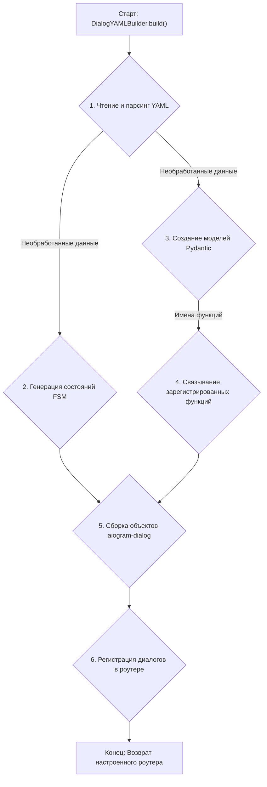
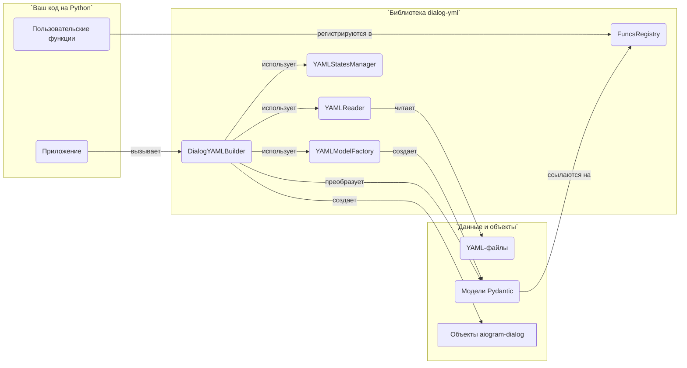

# dialog-yml

[English](README.md) | [Русский](README.ru.md)

[](https://www.python.org/downloads/) [](https://pypi.org/project/aiogram-dialog/) [](https://opensource.org/licenses/MIT) [](https://pypi.org/project/dialog-yml/)

---

> ⚠️ **ВНИМАНИЕ**: Эта библиотека является экспериментальной. Автор не несет ответственности за любые проблемы, которые могут возникнуть в результате ее использования.

Библиотека для Python, представляющая собой декларативный слой конфигурации на основе YAML для создания диалогов в [aiogram-dialog](https://github.com/tishka17/aiogram_dialog). `dialog-yml` функционирует как обертка, позволяя разработчикам описывать сложные диалоговые сценарии, окна и виджеты в формате YAML. Это значительно упрощает процесс разработки, однако не отменяет необходимости понимать ключевые концепции и принципы работы `aiogram-dialog`.

## 📖 Обзор

Основной компонент библиотеки — класс `DialogYAMLBuilder`. Он считывает конфигурацию из YAML-файлов и преобразует её в полноценные объекты диалогов `aiogram-dialog`. Такой подход ускоряет прототипирование и упрощает управление сложными диалоговыми структурами, значительно сокращая объем необходимого кода на Python.

## ✨ Возможности

- **Декларативное определение диалогов**: Определяйте диалоги, окна и виджеты с помощью YAML-файлов.
- **Модульная структура**: Поддержка включения отдельных YAML-файлов с помощью директивы `!include`.
- **Якоря YAML**: Поддержка якорей (`&`) и ссылок (`*`) в YAML для избежания дублирования кода.
- **Встроенные виджеты**: Поддержка различных виджетов `aiogram-dialog`, включая:
  - Текстовые элементы
  - Виджеты клавиатуры
  - Виджеты календаря
  - Виджеты выбора
  - Виджеты прокрутки
  - Виджеты-счетчики
  - Медиа-виджеты
  - и многие другие...
- **Пользовательские функции**: Расширяемый реестр функций для реализации собственной бизнес-логики.
- **Пользовательские модели**: Возможность регистрировать собственные модели виджетов.
- **Управление состояниями**: Автоматическая генерация и управление состояниями FSM из конфигурации YAML.
- **Гибкая конфигурация**: Поддержка пользовательских групп состояний и моделей.

## ⚙️ Как это работает

Библиотека организует преобразование декларативных YAML-файлов в функциональные объекты `aiogram-dialog`. Ниже представлен внутренний процесс и взаимодействие компонентов.

<details>
<summary><b>Диаграмма 1: Общая схема потока данных</b></summary>

Эта диаграмма показывает путь от YAML-файла до готового к использованию роутера `aiogram`.



</details>

<details>
<summary><b>Диаграмма 2: Взаимодействие компонентов</b></summary>

Эта диаграмма иллюстрирует, как взаимодействуют основные внутренние компоненты `dialog-yml`.



</details>

## 📦 Установка

Для установки используйте pip:

```bash
pip install dialog-yml
```

Или, если вы используете uv (рекомендуется):

```bash
uv pip install dialog-yml
```

## 🧰 Требования

- Python >= 3.13
- aiogram >= 3.24.0
- aiogram-dialog >= 2.4.0
- pydantic >= 2.12.5
- PyYAML >= 6.0.3
- pyyaml-include >= 2.2

## 👤 Использование (для пользователей)

### ⚙️ Базовая настройка

Вот базовый пример использования библиотеки:

```python
from aiogram import Router
from dialog_yml import DialogYAMLBuilder

# Собираем диалог из YAML-файла
dy_builder = DialogYAMLBuilder.build(
    yaml_file_name="main.yaml",
    yaml_dir_path="path/to/yaml/files",
    router=Router(),
)

# Получаем доступ к настроенному роутеру
router = dy_builder.router
```

### 📄 Структура YAML

Базовая структура YAML-файла для диалога:

```yaml
---
dialogs:
  DialogGroupName:  # Это станет именем StatesGroup
    launch_mode: ROOT  # Опциональный режим запуска
    windows:
      STATE_NAME:  # Это станет именем State
        widgets:
          - text: "Привет, мир!"
          - button:
              text: "Нажми меня"
              id: click_btn
              on_click: my_function
...
```

### ⚙️ Пользовательская логика с помощью функций

Хотя YAML отлично подходит для определения структуры UI, для бизнес-логики вам понадобятся функции на Python. `dialog-yml` позволяет связывать функции Python с вашими виджетами для двух основных целей: **обработчики событий** и **геттеры данных**.

Сначала вам нужно место для регистрации ваших функций.

```python
# funcs.py
from dialog_yml import FuncsRegistry

# Создаем глобальный реестр
funcs_registry = FuncsRegistry()

# Теперь добавляйте функции в этот реестр (см. примеры ниже)
```

`dialog-yml` использует глобальный синглтон для реестра. Вам не нужно передавать его в процессе сборки. Самое важное — **убедиться, что модуль Python, в котором вы определяете и регистрируете свои функции, импортирован** до запуска бота.

```python
# main.py - точка входа вашего приложения
from aiogram import Router
from dialog_yml import DialogYAMLBuilder

# Импортируем модуль, где вы определили `funcs_registry` и зарегистрировали функции.
# Это гарантирует, что функции будут добавлены в глобальный реестр.
import my_project.dialogs.funcs 

# ... настройка бота и диспетчера ...

# Теперь собираем диалоги. Сборщик автоматически найдет зарегистрированные функции.
dy_builder = DialogYAMLBuilder.build(
    yaml_file_name="main.yaml",
    yaml_dir_path="path/to/yaml/files",
    router=router,
)
```

#### Обработчики событий

Обработчики событий — это функции, которые реагируют на действия пользователя, такие как нажатие кнопки или выбор элемента. Вы можете назначать их на поля `on_click`, `on_selected`, `on_process_result` и т.д.

Ключевой момент, который нужно помнить: **сигнатура функции должна соответствовать тому, что ожидает `aiogram-dialog`** для конкретного обработчика. `dialog-yaml` просто передает вашу функцию дальше.

**Код на Python:**

```python
# funcs.py
from aiogram.types import CallbackQuery
from aiogram_dialog import DialogManager
from aiogram_dialog.widgets.kbd import Button

# Корректная сигнатура для события on_click кнопки
async def on_button_click(
    callback: CallbackQuery,
    widget: Button,
    manager: DialogManager,
):
    print(f"Кнопка '{widget.widget_id}' была нажата!")
    await manager.next()

funcs_registry.register(on_button_click)
```

**YAML-файл:**

```yaml
# ...
- button:
    text: "Нажми меня"
    id: click_btn
    on_click: on_button_click # Имя функции
```

> 💡 **Совет**: Чтобы найти правильную сигнатуру для обработчика, обратитесь к официальной [документации aiogram-dialog](https://aiogram-dialog.readthedocs.io/en/latest/).

#### Геттеры данных

Геттеры данных — это функции, которые поставляют динамические данные для ваших виджетов, например, текст для виджета `Format` или список элементов для виджета `Select`. Вы можете назначать их на поля `text`, `items`, `when` и т.д.

Эти функции обычно вызываются с аргументами `(DialogManager, **kwargs)` и должны возвращать данные в формате, ожидаемом виджетом.

**Код на Python:**

```python
# funcs.py
from aiogram_dialog import DialogManager

async def get_user_name(manager: DialogManager, **kwargs):
    # Вы можете получать данные из dialog_manager
    return {"user_name": manager.event.from_user.full_name}

async def get_products_for_select(**kwargs):
    return [
        ("Яблоки", "fruit_apple"),
        ("Апельсины", "fruit_orange"),
        ("Стейк", "meat_steak"),
    ]

funcs_registry.register(get_user_name)
funcs_registry.register(get_products_for_select)
```

**YAML-файл:**

```yaml
# ...
- text:
    text: "Привет, {user_name}!"
    data: get_user_name # Этот геттер предоставляет данные для форматирования
# ...
- select:
    id: products
    items: get_products_for_select # Этот геттер предоставляет список элементов
    item_id_getter: 1 # Использовать второй элемент кортежа как item_id
    on_selected: on_product_selected
```

#### Передача статических данных из YAML

Вы также можете передавать статические данные из вашего YAML-файла напрямую в вашу функцию Python. Это полезно для создания переиспользуемых функций.

Для этого определите ссылку на функцию как объект в YAML, где `name` — это имя функции, а другие ключи — ваши статические данные.

**Код на Python:**

```python
# funcs.py
from aiogram.types import CallbackQuery
from aiogram_dialog import DialogManager
from aiogram_dialog.widgets.kbd import Button

# Эта функция получит дополнительные данные в параметре `data`
async def on_navigate(
    callback: CallbackQuery,
    widget: Button,
    manager: DialogManager,
    data: dict,
):
    target_state = data.get("target_state")
    if target_state:
        # Здесь вам нужно преобразовать строку состояния в объект State
        # (Это упрощенный пример)
        await manager.start(target_state)

funcs_registry.register(on_navigate)
```

**YAML-файл:**

```yaml
# ...
- button:
    text: "Перейти в профиль"
    id: go_profile
    on_click:
      name: on_navigate
      target_state: "UserProfile:main" # Статические данные, передаваемые в функцию
- button:
    text: "Перейти в настройки"
    id: go_settings
    on_click:
      name: on_navigate
      target_state: "Settings:main" # Та же функция, другие данные
```

### 📌 Использование якорей YAML

Чтобы избежать дублирования в YAML-файлах, вы можете использовать якоря:

```yaml
---
anchors:
  back_button: &back
    id: back
    text: "Назад"
    state: Menu:MAIN
  multi_select: &multi_select_config
    checked: {val: "✓ {item[0]}", formatted: true}
    unchecked: {val: "{item[0]}", formatted: true}
    id: ms
    items: products
    item_id_getter: 1

windows:
  MAIN:
    widgets:
      - text: "Главное меню"
      - button:
          text: "В настройки"
          id: settings
          state: Settings:MAIN
  SETTINGS:
    widgets:
      - text: "Настройки"
      - multi_select: *multi_select_config
      - switch_to: *back
...
```

### 📁 Включение внешних YAML-файлов

Библиотека поддерживает включение внешних YAML-файлов с помощью директивы `!include`:

**main.yaml:**

```yaml
---
dialogs:
  Menu: !include menu.yaml
  Settings: !include settings.yaml
...
```

**menu.yaml:**

```yaml
---
launch_mode: ROOT
windows:
  MAIN:
    widgets:
      - text: "Главное меню"
      - start:
          text: "Перейти в настройки"
          id: settings_btn
          state: Settings:MAIN
...
```

## 👨‍💻 Разработка (для разработчиков)

### 📦 Установка для разработки

Если вы хотите внести свой вклад в разработку библиотеки, установите зависимости с помощью uv:

```bash
uv sync
```

Или с помощью pip:

```bash
pip install -e .
pip install -r requirements.txt
```

### 🧱 Зависимости

Все зависимости проекта зафиксированы в файле [requirements.txt](requirements.txt) и в секции `[project.dependencies]` файла `pyproject.toml`.

### 🛠️ Используемые инструменты

🐍 **uv** - основной менеджер пакетов проекта
🧼 **Ruff** - форматер и линтер кода
🧪 **pytest** - для запуска тестов
📦 **setuptools** - для сборки пакета

## 🏗️ Структура проекта

Библиотека имеет модульную структуру:

- `src/core.py`: Содержит основной класс `DialogYAMLBuilder`
- `src/reader.py`: Обрабатывает чтение YAML-файлов с поддержкой `!include`
- `src/models/`: Содержит определения моделей для различных компонентов диалога
  - `base.py`: Базовые классы моделей
  - `dialog.py`: Модель диалога
  - `window.py`: Модель окна
  - `widgets/`: Различные модели виджетов
  - `funcs/`: Модели, связанные с функциями
- `src/middleware.py`: Middleware для `dialog-yaml`
- `src/states.py`: Утилиты для управления состояниями

## 📚 Примеры

Смотрите репозиторий [dialog-yml-examples](https://github.com/smkthat/dialog-yml-examples) для комплексного примера, который демонстрирует:

- Несколько групп диалогов
- Различные типы виджетов
- Пользовательские функции
- Переходы между состояниями
- Включение YAML-файлов
- Использование якорей

Чтобы запустить пример:

1. Создайте файл `.env` с токеном вашего бота и уровнем логирования:

    ```
    MEGA_BOT_TOKEN=your_telegram_bot_token
    MEGA_BOT_LOG_LEVEL=INFO
    ```

2. Запустите пример:

    ```bash
    # Если используете uv (рекомендуется)
    PYTHONPATH=. uv run dialog-yml-examples/mega/bot.py
    
    # Или если используете python напрямую
    PYTHONPATH=. python dialog-yml-examples/mega/bot.py
    ```

> **Примечание**: `PYTHONPATH=.` необходим, чтобы Python мог корректно разрешать импорты модулей при запуске примера.

## ⌨️ Доступные команды

Этот проект использует Makefile для общих задач:

💡 `make help` - Показать доступные команды
🧼 `make format` - Отформатировать код с помощью Ruff
🔍 `make check` - Запустить проверки качества кода
🧪 `make test` - Запустить тесты
📊 `make test-cov` - Сгенерировать отчет о покрытии тестами
📈 `make test-html` - Сгенерировать HTML-отчет о покрытии тестами
🤖 `make mega-bot` - Запустить пример mega-бота

## 🧪 Тестирование

Запустите набор тестов:

```bash
make test
# или
python -m pytest tests/
```

## 📦 Сборка и публикация

Чтобы упаковать и опубликовать библиотеку, выполните следующие шаги:

1. Убедитесь, что у вас установлены необходимые инструменты:

    ```bash
    pip install build twine
    # или с помощью uv
    uv pip install build twine
    ```

2. Обновите версию в `pyproject.toml` перед публикацией.

3. Соберите дистрибутивы:

    ```bash
    python -m build
    # или с помощью uv
    uv run python -m build
    ```

4. Загрузите пакет на PyPI:

    ```bash
    python -m twine upload dist/*
    ```

Файл `.python-version` содержит версию Python, рекомендованную для разработки. Он не влияет на сборку пакета, но информирует других разработчиков, какую версию Python использовать при работе с проектом.

## 📄 Лицензия

Этот проект лицензирован в соответствии с условиями, указанными в файле [LICENSE](LICENSE).

## 🤝 Участие в разработке

Мы приветствуем ваш вклад! Пожалуйста, не стесняйтесь отправлять Pull Request. Для серьезных изменений, пожалуйста, сначала откройте issue, чтобы обсудить, что вы хотели бы изменить.
